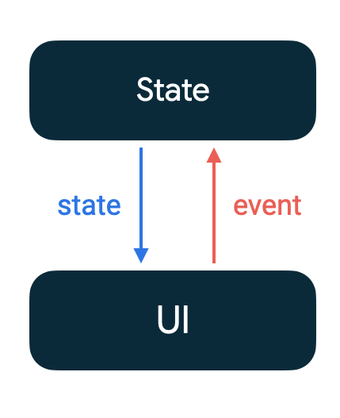
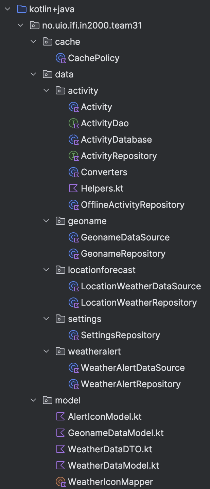
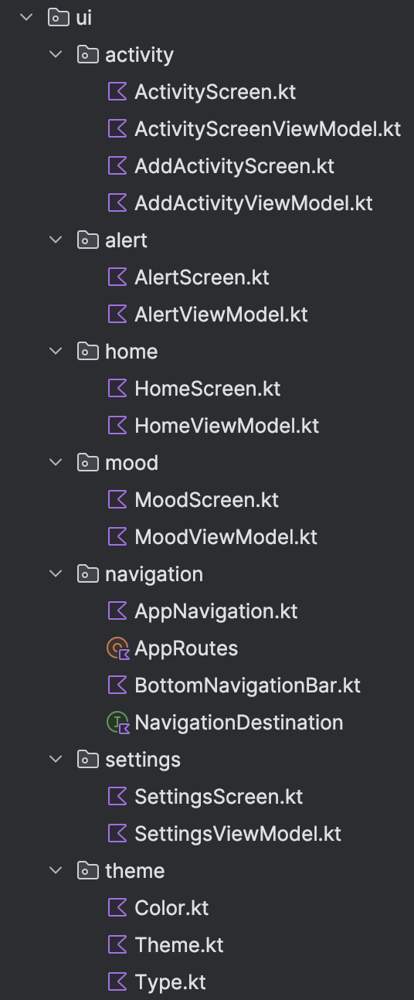

<h1>Arkitektur</h1>

<h2>MVVM (Model-View-ViewModel), SSOT (Single Source of Truth) og UDF (Unidirectional Data Flow)</h2>

<h3> MVVM </h3>

Vi bestemte oss tidlig for å basere arkitekturen i applikasjonen på MVVM (Model-View-ViewModel).
Vi valgte denne modellen fordi vi følte at det var en passende løsning, delvis basert på tidligere
erfaringer. Selv om vi til tider har støtt på utfordringer som dro oss bort fra MVVM har vi forsøkt
å finne løsninger som har gjort det mulig å fortsatt følge retningslinjene.

MVVM fordeler ansvaret i en applikasjon mellom tre komponenter, hver med sitt spesifikke formål.
Model representerer dataene og logikken i systemet. View er ansvarlig for strukturen, layouten og
utseendet til det brukeren ser på skjermen. ViewModel fungerer som et mellomledd: Det håndterer det
grafiske grensesnittet brukeren kan interagere med samtidig som det varsler View om eventuelle
endringer i tilstanden ved brukerinput, som for eksempel et klikk på skjermen.
(Stonis et al., 2022)

<h3> Lav kobling og høy kohesjon </h3>

Fordelingen av ansvar mellom de ulike komponentene i appen bidrar til å skape lav kobling og høy
kohesjon, to grunnleggende prinsipper innen programvareutvikling. Lav kobling betyr at komponenter
eller moduler bør være så uavhengige som mulig av hverandre, slik at endringer i én modul har ingen
eller liten påvirkning på andre moduler. Moduler bør med andre ord ikke ha kunnskap om de andre
modulenes funksjoner. Høy kohesjon betyr at moduler i en applikasjon bør ha tydelig definerte
ansvarsområder og bør kun håndtere en bestemt oppgave eller en del av funksjonaliteten.
(Common modularization patterns, 2023)

<h2>Utvikling</h2>

<h3>Front-end - Jetpack Compose</h3>

Vi har valgt å bruke Jetpack Compose i vårt Android-prosjekt. Jetpack Compose skiller seg fra den
tradisjonelle XML-layouten ved at den har en deklarativ tilnærming. Den deklarative syntaksen som
Jetpack Compose introduserer, erstatter den omfattende XML-koden for å beskrive grensesnittet, med
mer naturlig og lesbar kode som kan oppnå det samme grensesnittet. Dette gjør det enklere å forstå
koden og reduserer mengden av boilerplate-kode som ofte er involvert i håndteringen av XML-layoutens
UI-komponenter og attributter. En annen motsetning til XML er at man må håndtere manuelle
oppdateringer av grensesnittet, mens Jetpack Compose håndterer disse reaktivt. Dette betyr at
grensesnittet automatisk oppdateres når dataene endres, noe som reduserer risikoen for UI-relaterte
feil og gjør koden mer robust.
(Kurcheuskay, 2023)

<h3>Back-end</h3>

Når det kommer til back-end utviklingen av appen har vi prøvd å følge noen av de vanligste
arkitektoniske prinsippene fra Android Developers “Guide to App Architecture”, om å separere
data-laget og UI-laget, ha en Single Source of Truth (SSOT) og Unidirectional Data Flow (UDF).

<h3>Single Source of Truth (SSOT)</h3>

I UI-laget har vi klassene til de forskjellige skjermene og viewmodels. Hver ViewModel fungerer som
en slags SSOT for de dataene de håndterer og holder på UI-states som skjermene kan hente direkte.
Fordelene med SSOT er at man sørger for at alle endringer knyttet til en bestemt type data utføres
på ett sted. Dette gjør det enklere å vedlikeholde og oppdatere dataen, og reduserer sjansen for
uventede endringer. SSOT sikrer at bare den har tillatelse til å endre dataen den selv eier.
Dette bidrar til å forhindre utilsiktede endringer eller feil som kan oppstå hvis flere deler av
programmet prøver å endre dataene samtidig. Det blir også enklere å spore og feilsøke eventuelle
problemer som oppstår i forbindelse med dataen. Dette øker generelt kvaliteten på koden og reduserer
risikoen for feil.
(Stonis et al., 2022)

Prinsippet om SSOT forteller oss at i MVVM vil ViewModel være den eneste komponenten som har
rettighetene til å oppdatere eller endre dataen. Dette betyr at View eller Model ikke kan direkte
endre dataen som ViewModelen holder på. Slik forklarer Microsoft interaksjonen mellom disse
komponentene: “At a high level, the view "knows about" the view model, and the view model "knows
about" the model, but the model is unaware of the view model, and the view model is unaware of the
view. Therefore, the view model isolates the view from the model, and allows the model to evolve
independently of the view.”
(Stonis et al., 2022).

En av fordelene med MVVM er at komponentene i datalaget kan utvikle seg uavhengig av det som vises.
Dermed blir det lettere å identifisere feil, teste, vedlikeholde og videreutvikle applikasjonen.
Det kan også forbedre mulighetene for kodegjenbruk og legger til rette for at utviklere og designere
kan samarbeide mer effektivt når de utvikler sine egne deler av en app.
(Stonis et al., 2022)

<h3>UDF (Unidirectional Data Flow)</h3>

MVVM baserer seg på Android Developers anbefalte designmønster UDF (Unidirectional Data Flow)
(Guide to App Architecture, 2023) der states, eller tilstander, flyter nedover mens events flyter
i motsatt retning. Oppdateringsflyten i en app som følger UDF ser slik
ut:  

**Event**: En del av UI-et genererer en hendelse, for eksempel at en bruker trykker på en knapp.
Dette sendes videre oppover og blir håndtert av ViewModel.

**Update state**: En hendelseshåndterer kan endre tilstanden og disse oppdateringene gjenspeiles
umiddelbart i grensesnittet ved hjelp av observerbare tilstandsholdere, som for eksempel StateFlow.

**Display state**: State holderen sender tilstanden nedover, og UI-et viser den på skjermen.

(Architecting your Compose UI, 2024)

    <figure style="display: inline-block; margin: 10px;">
        
        <figcaption><em>Figur 1: Figuren viser "unidirectional data flow".</em>
        </figcaption>
    </figure>

 

<h3>Manual Dependency Injection</h3>

Når vi har skille mellom oppgaver ("separation of concerns") der hver klasse i hierarkiet har et
enkelt definert ansvarsområde, fører dette til flere, mindre klasser som må kobles sammen for å
oppfylle hverandres avhengigheter. Vi har derfor implementert manual dependency injection i appen
vår, som er en av de anbefalte teknikkene innen moderne app-arkitektur.
(Guide to app architecture, 2023). Det er nyttig for å lage skalerbare og testbare Android-apper.
Ved hjelp av containere kan man dele instanser av klasser i forskjellige deler i en applikasjon,
og fungerer som et sentralisert sted for å opprette instanser av klasser.
(Manual dependency injection, 2023)

I appen vår har vi klassene AppContainer og MyApplication der disse to har forskjellige oppgaver:

**AppContainer**: Denne klassen er ansvarlig for å opprette og inneholde instanser av forskjellige
klasser som er nødvendige for applikasjonen. I vårt tilfelle oppretter vi instanser av
locWeatherDataSource og alertDataSource, som deserialiserer dataen vi henter fra API-ene
LocationForecast og MetAlerts. Deretter oppretter vi instansene locWeatherRepository og
alertRepository og legger inn referansene til de tilhørende datasource-klassene. De håndterer
henting, caching og behandling av værdataene før de sendes tilbake til UI-et for visning

***MyApplication**: Dette er en Application-klasse som brukes til å initialisere AppContainer.
Denne app-containeren blir igjen opprettet i HomeViewModel slik at vi aksesserer containerens
locWeatherRepository og alertRepository.  

Ved å bruke manual dependency injection, ved hjelp av
f.eks. AppContainer oppretter man instanser av nødvendige klasser på et sentralisert sted. Dette
gjør koden mer modulær og lettere å vedlikeholde, siden man ikke trenger å gjenta
opprettelseslogikken for instanser av klasser overalt i koden.
(Manual dependency injection, 2023)

<h3>Databasen</h3>

Vi benyttet oss av en lokal database for lagring av aktiviteter som er aksesserbar uten
internettilgang. Denne løsningen bruker Room, som er et bibliotek som tilbys av Android Jetpack
som gjør det enklere å jobbe med SQLite-databaser i Android-apper.

<h2>API nivå</h2>

Vi har utviklet appen vår med en “Target SDK” API-nivå 33. “Target SDK” refererer til API-nivået
appen er hovedsakelig utviklet i. I henhold til oppgaven vår er dette et hensiktsmessig API-nivå
som tar opp brukersikkerhet og ytelse som hovedfokus. Dette blir gjort i forskjellige permissions
(Developers, 2024). I vårt prosjekt brukte vi Request Location Permissions for å spørre om brukerens
lokasjon. Brukeren får et valg om graden de vil dele lokasjonen sin og
derfor sikrer dette bedre personvern. Vi har også API 26 som vårt minimum for SDK. Dette er på grunn
av at java-biblioteket LocalDataTime krever API 26 eller høyere. Dette er et nødvendig verktøy for
funksjonene som deltakere i vårt prosjekt eksplisitt ville ha implementert.

<h2>Struktur</h2>

Appen vår er delt inn i forskjellige mapper, som igjen er delt inn i undermapper.
Slik som i figur 2 og 3 følger vi en litt annen MVVM-struktur der vi skiller de forskjellige
mappene i data, ui, model og cache. Selv om vi kunne ha fulgt en mer typisk struktur (Model, View og
ViewModel) var dette mer hensiktsmessig i utviklingen av appen vår. Hensiktsmessig i for eksempel at
ui inneholder view og viewmodel. Dette blir enklere å aksessere og feilsøke hvis feil skulle forekomme.

Mer detaljert er selve datahenting og prosessering av denne dataen i data mappen.
Den er igjen delt inn i mappene geoname, locationforecast og weatheralert. Disse undermappene
inneholder mer spesifikt filer som inneholder- eller tar imot data fra de respektive API-ene. Et
eksempel er alt om værdata utenom farevarsler ligger i undermappen locationforecast.

Ui-mappen derimot har activity, alert, home, mood, navigation, settings og theme som undermapper.
Disse mappene har ansvar for visning av dataene og kommunikasjon mellom data og ui-laget gjennom
viewmodeller.  I undermappen home ligger koden bak den visuelle hjemskjermen man ser på appen.
Denne mappen ligger det også HomeViewModel som fungerer som en mellommann mellom modellen og
visningen - her kan man se forskjellige UI states som brukes av UI.

Model mappen har sin funksjon i å gjøre datahentingen lettere og mer strukturert. Det blir gjort ved
å representere og behandle data som passer appens behov og funksjonalitet i klassene: AlertIconModel,
WeatherDataDTO, WeatherDataModel og WeatherIconMapper. Et eksempel er i et av undermappene
WeatherDataModel som har representasjoner om værdata for en bestemt tid. Denne klassen inneholder
blant annet egenskaper som tid, lufttemperatur og symbolkode. Vi har slike klasser for å organisere
dataene i modeller slik at det er enklere for andre deler av appen å få tilgang og bruke disse dataene.
Disse blir brukt i blant annet av viewmodeller som er med å presentere dataene til brukeren på en
brukervennlig måte.

Den siste hovedmappen er cache. Denne mappen er ansvarlig for lagring av allerede hentet data for å
unngå unødvendige nettverksforespørsler. Den eneste undermappen i cache er CachePolicy som inneholder
enum klassen type som igjen har verdiene NEVER, ALWAYS og REFRESH. Disse  hjelper oss om å bestemme
hvor vi henter data fra og om vi vil ha dataen i cache. Et eksempel er Type.REFRESH som gjør at man
henter data fra API-et og cacher dataen, i motsetning til Type.NEVER der man henter fra API-et, men
ikke cacher dataen. Dette kan være hensiktsmessig hvis vi vil sikre oppdatert data, men ikke ønsker
å øke belastningen på nettverket. Slike kodesnutter er viktig for færre API-kall og bedring av
appens ytelse.

    <figure style="display: inline-block; margin: 10px;">
        
        <figcaption><em>Figur 2: Figuren viser mappestruktur   for data-laget.</em>
        </figcaption>
    </figure>
    <figure style="display: inline-block; margin: 10px;">
        
        <figcaption><em>Figur 3: Figuren viser mappestruktur   for UI-laget.</em>
        </figcaption>
    </figure>

