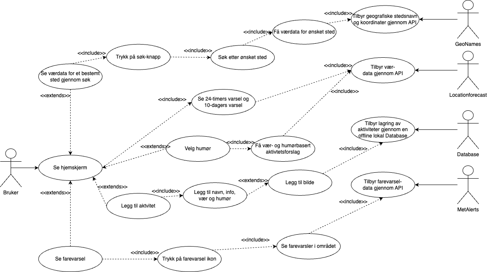
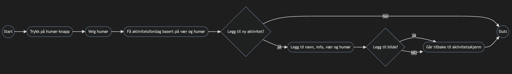
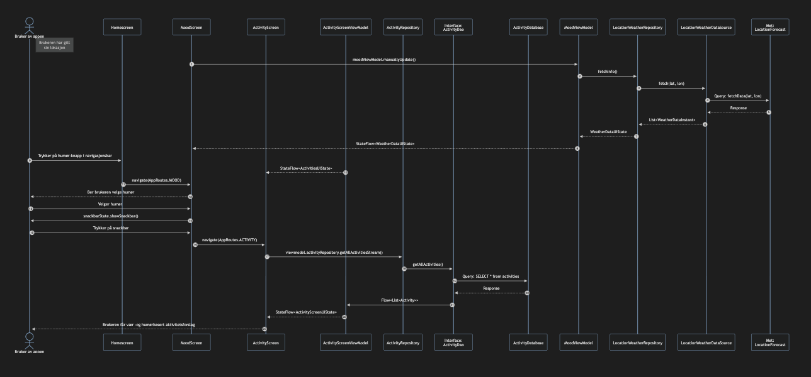
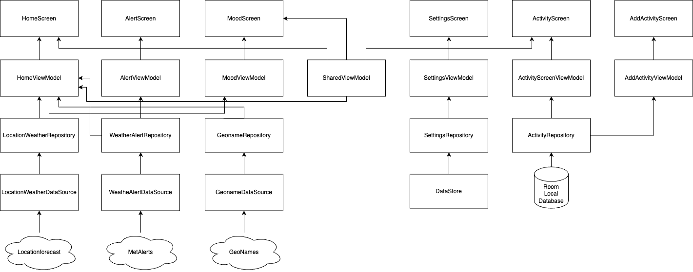
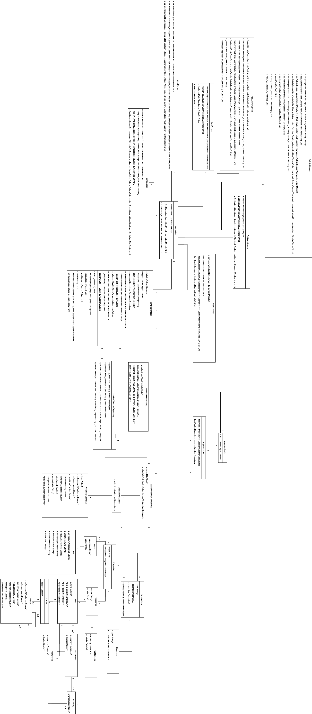

<h1>Modellering</h1>

<h2>Use-case</h2>

<h3>Use-case modellering</h3>

I use-case diagrammet har vi modellert fire use-case:
1. Se aktivitetsforslag basert på vær og humør
2. Legg til aktivitet 
3. Se farevarsel
4. Se værdata for et bestemt sted gjennom søk

    <figure style="display: inline-block; margin: 10px;">
        
        <figcaption><em>Figur 1: Figuren viser use-case diagrammet for de fire use-casene.</em>
        </figcaption>
    </figure>

<h2>Use-case tekstlig</h2>

<h3>Use-case 1</h3>

**Use-case 1**: Se aktivitetsforslag basert på vær og humør  
**Primæraktør**: Bruker av app  
**Sekundæraktør**: Locationforecast (API fra MET)  
**Prebetingelse**: Bruker har gitt appen tilgang på enhetens lokasjon, og brukeren har vært inne på aktivitetskjermen før.  
**Postbetingelse**: Brukeren får aktivitetsforslag basert på vær og humør

**Hovedflyt**:

1. Systemet ber sekundæraktøren om å hente data om været nå basert på posisjonen til brukeren og viser dette frem på humør skjerm.
2. Brukeren trykker på humør-knapp i navigasjonsbar.
3. Systemet navigerer brukeren til Mood Screen.
4. Brukeren ser været nå og flere humør. 
5. Brukeren velger et humør.
6. Systemet viser en snackbar.
7. Brukeren trykker på snackbaren.
8. Systemet navigerer brukeren til Activity Screen.
9. Systemet oppdaterer Activity Screen basert på vær og humør.
10. Brukeren ser en liste over aktivitetsforslag.

**Alternativ flyt punkt 8**:

8.1 Systemet klarer ikke hente aktivitetene for øyeblikket  
8.2 Brukeren forblir på den aktivitetsskjermen uten oppdaterte aktiviteter  

**Alternativ flyt punkt 10**:

10.1 Brukeren trykker på knapp for å legge til en aktivitet.  
10.2 Systemet navigerer brukeren til AddActivityScreen.  
10.3 Systemet ber brukeren fylle inn de nødvendige feltene for navn, info, vær og humør og evt. bilde.  
10.4 Brukeren fyller inn den nødvendige dataen og trykker for å lagre aktiviteten.  
10.5 Systemet lagrer aktiviteten i databasen og oppdaterer aktivitetsskjermen med den nye aktiviteten.   
10.6 Systemet navigerer brukeren tilbake til aktivitetsskjermenen.  
10.7 Brukeren ser aktivitetene fra før og den nye aktiviteten. 

 
<h3>Aktivitetsdiagram for use-case 1:</h3>

    <figure style="display: inline-block; margin: 10px;">
        
        <figcaption><em>Figur 2: Figuren viser aktivitetsdiagrammet for use-case 1.</em>
        </figcaption>
    </figure>

 
<h3>Sekvensdiagram for use-case 1:</h3>

    <figure style="display: inline-block; margin: 10px;">
        
        <figcaption><em>Figur 3: Figuren viser sekvensdiagrammet for hovedflyten i use-case 1.</em>
        </figcaption>
    </figure>

<h3>Use-case 2</h3>

**Use-case 2**: Legge til aktivitet  
**Primæraktør**: Bruker av app  
**Sekundæraktør**: Lokal database  
**Prebetingelse**: Bruker har gitt appen tilgang på enhetens lokasjon  
**Postbetingelse**: Brukeren for lagt inn en aktivitet etter eget ønske

**Hovedflyt**:

1. Brukeren trykker på aktivitets-knappen
2. Systemet navigerer brukeren til aktivitets-skjermen, der brukeren ser alle aktiviteter som passer det spesifikke værforholdet.
3. Brukeren trykker på knappen for å legge til aktivitet.
4. Systemet navigerer brukeren til AddActivityScreen.
5. Brukeren blir bedt om å fylle inn nødvendig data for den nye aktiviteten
6. Brukeren fyller inn dataen.
7. Brukeren trykker på knapp for å lagre aktiviteten.
8. Systemet navigerer brukeren tilbake til aktivitets-skjermen der den nye aktiviteten er lagt til.

**Alternativ flyt punkt 5**:

5.1 Brukeren trykker på tilbake-knappen  
5.2 Systemet navigerer brukeren tilbake til aktivitetsskjermen.

 
<h3>Use-case 3</h3> 

**Use-case 3**: Se farevarsel  
**Primæraktør**: Bruker av app  
**Sekundæraktør**: MetAlerts (API fra MET)  
**Prebetingelse**: Bruker har gitt appen tilgang på brukerens lokasjon og det er farevarsler i området  
**Postbetingelse**: Brukeren får farevarsel basert på lokasjon

**Hovedflyt**:
1. Systemet ber sekundæraktøren om å hente farevarsler basert på posisjonen til brukeren.
2. Sekundæraktøren returnerer en liste av farevarsler.
3. Brukeren trykker på farevarsel-ikon.
4. Brukeren ser en liste av farevarsler i det gjeldende området.

**Alternativ flyt punkt 1**:

1.1 Systemet venter på tilbakemelding fra den sekundære aktøren, men mottar ingen respons til tross for at en forespørsel om farevarsler er sendt.  
1.2 Ingen farevarsel-ikon dukker opp  
1.3 Brukeren forblir på den gjeldende skjermen (hjem-skjerm)

 
<h3>Use-case 4</h3>

**Use-case 4**: Søk på lokasjon for å se værdata  
**Primæraktør**: Bruker av app  
**Sekundæraktør**: Locationforecast (API fra MET), GeoNames API  
**Prebetingelse**: Bruker har gitt appen tilgang på brukerens lokasjon  
**Postbetingelse**: Brukeren får værdata basert på lokasjon

**Hovedflyt**:  
1. Brukeren trykker på søkeknapp
2. Brukeren søker etter ønsket sted.
3. Systemet returnerer en liste over steder basert på det brukeren har skrevet inn.
4. Brukeren velger et sted fra listen.
5. Systemet ber om værdata fra sekundær-aktørene for det valgte stedet.
6. Brukeren omdirigeres til den oppdaterte hjemskjermen, som nå viser værforholdene for det valgte stedet.

**Alternativ flyt punkt 5**:

5.1 Værdataene kan ikke hentes fra sekundær-aktørene på grunn av tekniske problemer eller utilgjengelighet.  
5.2 De forskjellige komponentene på hjemskjermen viser at de prøver å hente data.  
5.3 Brukeren forblir på den gjeldende skjermen uten oppdaterte værdata. 

 
<h1>Arkitekturskisse</h1> 

    <figure style="display: inline-block; margin: 10px;">
        
        <figcaption><em>Figur 4: Figuren viser arkitekturskissen for MoodCast, med de mest relevante klassene.</em>
        </figcaption>
    </figure>

 
<h1>Klassediagram<h1>

    <figure style="display: inline-block; margin: 10px;">
        
        <figcaption style="font-size: small;"><em>Figur 5: Figuren viser klassediagrammet for MoodCast. Diagrammet viser innhentingen av dataen fra Locationforecast som gjennom LocationWeatherRepository gjør dataen klar for UI-laget å bruke. Diagrammet illustrerer også manual dependency injection ved bruk av Application og AppContainer. Til slutt viser diagrammet de ulike skjermene som vi kan navigere mellom.</em>
        </figcaption>
    </figure>

